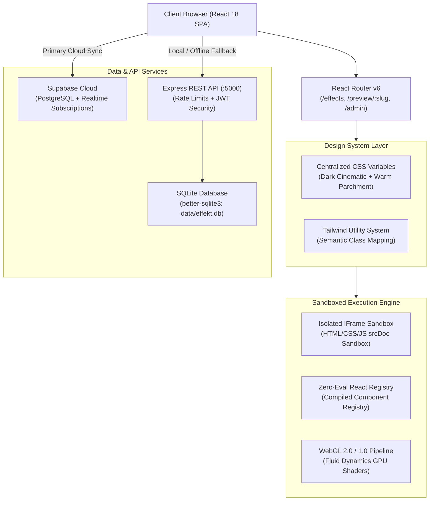

# ⚡ CodeSpark

<div align="center">

[](https://opensource.org/licenses/MIT)
[](package.json)
[](https://react.dev)
[](https://www.typescriptlang.org/)
[](https://tailwindcss.com)
[](https://vitejs.dev)
[](docs/CONTRIBUTING.md)

**The living library for frontend UI effects, micro-interactions & WebGL animations.**<br />
*Preview live, understand the math, copy clean code, and ship standout interfaces.*

[Explore Documentation](docs/ARCHITECTURE.md) • [Design System](docs/DESIGN_SYSTEM.md) • [REST API](docs/API.md) • [Contributing Guide](docs/CONTRIBUTING.md)

</div>

---

## 📖 Table of Contents

- [Executive Summary](#-executive-summary)
- [System Architecture](#-system-architecture)
- [Quick Start (60 Seconds)](#-quick-start-60-seconds)
- [Design System & Color Tokens](#-design-system--color-tokens)
- [Component Sandboxing Engine](#-component-sandboxing-engine)
- [Project Directory Map](#-project-directory-map)
- [Default Admin Credentials](#-default-admin-credentials)
- [Engineering Documentation Suite](#-engineering-documentation-suite)
- [License & Credits](#-license--credits)

---

## 🎯 Executive Summary

CodeSpark is a developer-focused open-source platform that eliminates the friction between discovering a great interaction and shipping it in production. It hosts a curated catalog of **hover effects, 3D tilt cards, text scramblers, WebGL fluid cursors, ambient loaders, and scroll transitions**.

### Why CodeSpark?
- **Zero Framework Lock-in**: Every effect provides standalone vanilla HTML, modern CSS keyframes, and optional JavaScript or React components.
- **Isolated Execution Sandboxing**: Untrusted community submissions run in secure sandboxed iframes without access to cookies, auth tokens, or parent DOM.
- **Zero-Eval React Engine**: Official React components are pre-compiled and mapped statically—no dangerous `eval()` or runtime code execution.
- **Dual-Mode Persistence**: Seamlessly switches between **Supabase Cloud (PostgreSQL)** and a self-contained local **SQLite database**.

---

## 🏗️ System Architecture



*For comprehensive architecture specifications, read [`docs/ARCHITECTURE.md`](docs/ARCHITECTURE.md).*

---

## 🚀 Quick Start (60 Seconds)

### 1. Clone & Install Dependencies
```bash
git clone https://github.com/chetanprajapat/codespark.git
cd codespark
npm install
```

### 2. Run Both Frontend & Backend (One Command)
```bash
npm start
```
- **Frontend App**: [http://localhost:5173](http://localhost:5173)
- **Backend API**: [http://localhost:5000/api](http://localhost:5000/api)

### 3. Or Run Independently
```bash
# Start Backend API Server
npm run server

# Start Frontend Vite Dev Server
npm run dev

# Run Production Build
npm run build
```

---

## 🎨 Design System & Color Tokens

CodeSpark uses a centralized CSS Custom Property token architecture declared in `src/index.css` and mapped into `tailwind.config.js`:

| Token | Dark Theme (Cinematic) | Light Theme (Parchment) | Description | Contrast Ratio |
| :--- | :--- | :--- | :--- | :--- |
| `--bg-primary` | `#0D0F12` | `#FAF6EE` | Canvas base background | — |
| `--bg-secondary` | `#12151A` | `#F5EFE6` | Surface cards & marquee bands | — |
| `--bg-elevated` | `#171A20` | `#FFFFFF` | Code blocks, popovers, inputs | — |
| `--text-primary` | `#F5F1EA` | `#0F1115` | Main titles & headings | **16.1 : 1 (AAA)** |
| `--text-secondary`| `#C8C2B9` | `#514B44` | Subtitles, body descriptions | **11.0 : 1 (AAA)** |
| `--text-muted` | `#918A80` | `#766F66` | Metadata, tags, placeholders | **5.9 : 1 (AA)** |
| `--border` | `rgba(245,241,234,0.14)` | `rgba(20,18,16,0.12)` | Subtle 1px component borders | — |
| `--accent` | `#FF4B32` | `#FF4B32` | CodeSpark signature orange/red | **4.9 : 1 (AA)** |
| `--accent-hover` | `#FF624B` | `#FF624B` | Interactive hover state | — |

*For complete typography scales and accessibility details, see [`docs/DESIGN_SYSTEM.md`](docs/DESIGN_SYSTEM.md).*

---

## 🛡️ Component Sandboxing Engine

To ensure untrusted community code can never exploit the parent host or access user sessions, CodeSpark implements **triple-barrier security**:

1. **Sandboxed `<iframe>` Isolation**:
   `LivePreview.tsx` creates an isolated document with `sandbox="allow-scripts"`. The preview has no access to parent `localStorage`, cookies, or the DOM.
2. **Zero-Eval React Execution**:
   Compiled React effects (such as `SplashCursor`, `SpotlightCard`, `TiltCard`) are registered statically in `src/effects/registry.tsx`. The platform **never uses `eval()` or `new Function()`**.
3. **Automated Honeypots & Rate Limiting**:
   Public endpoints (submissions, newsletter, contact) enforce strict per-IP rate limits and honeypot traps (`website_alt`) to reject automated spam.

---

## 📂 Project Directory Map

```
codespark/
├── docs/                      # Enterprise Documentation Suite
│   ├── ARCHITECTURE.md        # System architecture, sandboxing & state
│   ├── DESIGN_SYSTEM.md       # Color tokens, typography, accessibility
│   ├── API.md                 # REST API endpoints & payload schemas
│   └── CONTRIBUTING.md        # Open-source guide & effect creation
├── server/                    # Express REST Server
│   ├── routes/                # auth, effects, admin, contact, newsletter
│   ├── db.ts                  # SQLite schema initialization & seeding
│   └── index.ts               # Server entry point (port 5000)
├── src/                       # React 18 Application
│   ├── components/            # UI components
│   │   ├── base/              # Micro-interactions (Reveal, transitions)
│   │   └── feature/           # Navbar, Footer, EffectCard, LivePreview, CodeBlock
│   ├── context/               # AuthContext, SavedContext, MaintenanceContext
│   ├── data/                  # In-app documentation (manualDocs.ts)
│   ├── effects/               # Zero-eval React effect implementations & registry
│   ├── pages/                 # Page routes (home, effects, preview, admin, etc.)
│   ├── router/                # React Router v6 route configuration
│   └── index.css              # Centralized CSS variables & utility layers
├── tailwind.config.js         # Theme color mappings & keyframe animations
└── vite.config.ts             # Vite bundler configuration & local API proxy
```

---

## 🔑 Default Admin Credentials

When running with the local SQLite server, the database is auto-seeded with default administration credentials:

- **Admin Portal**: [http://localhost:5173/admin](http://localhost:5173/admin)
- **Email**: `admin@codespark.dev`
- **Password**: `Admin@123`

*(Please change these credentials before deploying to a public production environment!)*

---

## 📚 Engineering Documentation Suite

| Document | Description |
| :--- | :--- |
| **[`docs/ARCHITECTURE.md`](docs/ARCHITECTURE.md)** | Deep architectural breakdown, iframe sandboxing mechanics, and state lifecycle. |
| **[`docs/DESIGN_SYSTEM.md`](docs/DESIGN_SYSTEM.md)** | Token definitions, contrast calculations, and typography scale guidelines. |
| **[`docs/API.md`](docs/API.md)** | Full REST endpoint reference, query parameters, and JSON schemas. |
| **[`docs/CONTRIBUTING.md`](docs/CONTRIBUTING.md)** | Step-by-step developer tutorial on building and registering new UI effects. |

---

## 📄 License & Credits

- **License**: Released under the [MIT License](LICENSE). Free for personal and commercial projects.
- **Crafted with passion**: By developers, for developers. Built to make the web move.
