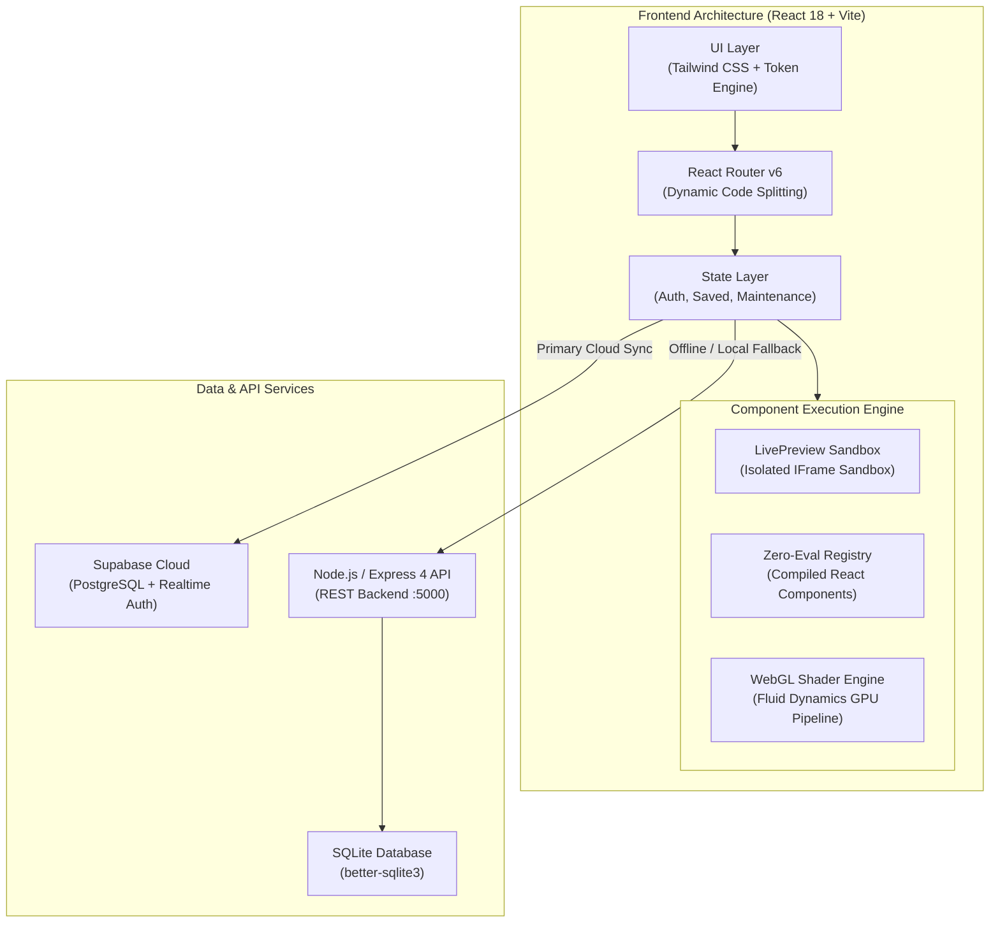

# CodeSpark System Architecture & Engineering Guide

> An in-depth technical manual on the system design, execution sandboxes, state management, security boundaries, and rendering pipelines powering CodeSpark.

---

## 1. High-Level Architecture Overview

CodeSpark is engineered as a hybrid client-first developer platform combining a high-performance **React 18 Single Page Application (SPA)**, a sandboxed **Component Execution Engine**, and a resilient **Dual-Database Layer (Supabase + Local SQLite REST API)**.



---

## 2. Component Execution Architecture

One of the greatest security and performance challenges in developer interaction libraries is running untrusted community-submitted code alongside production application code. CodeSpark solves this through **dual-mode execution sandboxing**:

### A. The Sandboxed IFrame Engine (`LivePreview.tsx`)
For user-submitted HTML, CSS, and vanilla JavaScript components, CodeSpark uses an isolated sandboxed `<iframe>` created dynamically via `srcDoc`:

1. **DOM Isolation**: The preview runs in an independent browser execution context. It has **zero access** to the parent window's `localStorage`, cookies, JWT auth tokens, or parent DOM.
2. **Sandbox Attributes**: 
   - `allow-scripts`: Permits animations and interaction scripts to execute.
   - `allow-same-origin`: **Disabled** by default to prevent sandbox escapes.
   - `allow-modals`: **Disabled** to block `alert()`, `confirm()`, or phishing popups.
3. **Reactive Props Propagation**:
   - The parent React component injects interactive overrides (`customText`, `customSubText`, `customColor`, `darkStage`) via templated CSS variable injection and DOM text node substitution before writing to `srcDoc`.
   - On canvas theme toggle, the iframe receives CSS variable overrides directly:
     ```css
     :root {
       --stage-bg: #0D0F12;
       --stage-text: #F5F1EA;
       --stage-accent: #FF4B32;
     }
     ```

### B. The Zero-Eval Compiled Registry (`src/effects/registry.tsx`)
For official, verified, and high-performance React effects, CodeSpark enforces a strict **Zero-Eval policy**:
- **No `eval()`**, **No `new Function()`**, and **No runtime Babel transpilation**.
- Components are compiled statically at build time into the application bundle.
- Each component is registered in `EFFECT_REGISTRY`:
  ```typescript
  export const EFFECT_REGISTRY: Record<string, React.ComponentType<any>> = {
    SplashCursor: SplashCursorWrapper,
    SpotlightCard: SpotlightCardWrapper,
    TiltCard: TiltCardWrapper,
    // ...
  };
  ```
- This guarantees **instant 0ms mount time**, **full TypeScript type safety**, and **zero vulnerability to arbitrary script injection**.

### C. WebGL Shader Rendering Pipeline (`SplashCursor.tsx`)
High-performance visual effects (such as the WebGL Fluid Cursor) bypass the DOM completely and execute directly on the GPU:
- Built with custom GLSL vertex and fragment shaders.
- Employs **Double-Buffered Framebuffers (Ping-Pong FBOs)** to calculate advection, divergence, pressure Poisson equations, and vorticity confinement in real time.
- Uses floating-point linear texture filtering with automatic 8-bit fallback for mobile GPU compatibility.
- Hardware render loops run inside `requestAnimationFrame` with passive pointer listeners for battery efficiency and 60+ FPS fluidity.

---

## 3. State Management Architecture

CodeSpark avoids monolithic state managers (like Redux) in favor of lightweight, purpose-driven **React Context Providers**:

```
App
├── I18nextProvider          # Internationalization engine
├── AuthProvider             # JWT auth, user role & session
├── MaintenanceProvider      # System lockdown & global alerts
└── SavedProvider            # Bookmarks, likes & collection sync
    └── BrowserRouter
        └── AppRoutes
```

### 1. `AuthContext`
- **Role-Based Access Control (RBAC)**:
  - `user`: Standard member (can like, save, submit effects).
  - `moderator`: Can review submissions and manage community requirements.
  - `admin`: Full platform control (approve effects, modify tags, ban abusers).
  - `superadmin`: Master Console owner (grant admin privileges, database controls).
- **Session Lifecycle**:
  - Automatically loads and verifies token from `localStorage` on boot.
  - Intercepts 401 Unauthorized responses to purge invalid tokens and redirect to `/login`.

### 2. `SavedContext`
- **Optimistic UI Updates**: When a user clicks "Like" or "Save", the UI reflects the change immediately (toggling icon state and incrementing counter) before the network request resolves.
- **Dual Persistence**:
  - Authenticated users: Synced to Supabase/SQLite database.
  - Unauthenticated guests: Cached in `localStorage` so bookmarks survive page reloads.

### 3. `MaintenanceContext`
- Allows administrators to put the site into maintenance mode during scheduled migrations.
- Broadcasts real-time administrative banners without requiring redeployments.

---

## 4. Backend & Database Architecture

CodeSpark supports a resilient **Dual-Mode Data Architecture**:

### Primary Mode: Supabase Cloud (PostgreSQL)
- Schema defined in `supabase/migrations/`.
- Row-Level Security (RLS) policies restrict write operations to owners and staff.
- Realtime subscriptions enable live updates for likes, views, and comments.

### Secondary Mode: Self-Contained SQLite REST API
- Built with Express 4 and `better-sqlite3` (`server/`).
- Automatically creates and seeds `data/effekt.db` with default admin credentials and verified components on first run.
- Zero external dependencies required to run the platform locally or offline.

---

## 5. Security & Hardening Architecture

CodeSpark enforces enterprise security practices throughout its stack:

| Vulnerability Type | Mitigation Strategy | Implementation Details |
| :--- | :--- | :--- |
| **XSS (Cross-Site Scripting)** | Strict IFrame Sandboxing + DOMPurify | Dynamic code previews execute inside sandboxed iframes without `allow-same-origin`. |
| **Code Injection / RCE** | Zero-Eval Policy | No runtime evaluation (`eval` or `Function()`) of React code. |
| **Brute Force & Credential Stuffing** | Rate Limiting + bcrypt | Express middleware enforces rate limits; passwords hashed with salt rounds. |
| **Spam Submissions** | Honeypot Form Traps | Hidden trap inputs (`website_alt`) trap automated bot submissions silently. |
| **CSRF / Unauthorized Requests** | Bearer JWT Validation | REST routes validate `Authorization: Bearer <token>` signed with secure secrets. |
| **Information Disclosure** | Environment Guardrails | Frontend code references only public `VITE_` variables; service secrets remain server-side. |

---

## 6. Directory Map & File Responsibilities

```
codespark/
├── docs/                      # Enterprise Documentation Suite
│   ├── ARCHITECTURE.md        # System architecture & sandboxing (this file)
│   ├── DESIGN_SYSTEM.md       # Color tokens, typography, accessibility
│   ├── API.md                 # REST API endpoints & payload schemas
│   └── CONTRIBUTING.md        # Git workflow, PR templates & standards
├── server/                    # Express REST Server
│   ├── routes/                # auth, effects, admin, contact, newsletter
│   ├── db.ts                  # SQLite schema creation & seed script
│   └── index.ts               # Server entry point (port 5000)
├── src/                       # React 18 Application
│   ├── components/            # UI components
│   │   ├── base/              # Micro-interactions (Reveal, transitions)
│   │   └── feature/           # Navbar, Footer, EffectCard, LivePreview, CodeBlock
│   ├── context/               # AuthContext, SavedContext, MaintenanceContext
│   ├── data/                  # In-app documentation (manualDocs.ts)
│   ├── effects/               # Zero-eval React effect implementations & registry
│   ├── pages/                 # Page route views (home, effects, preview, admin, etc.)
│   ├── router/                # React Router v6 route configuration
│   └── index.css              # Centralized CSS variables & utility layers
├── tailwind.config.js         # Theme color mappings & keyframe animations
└── vite.config.ts             # Vite bundler configuration & local API proxy
```
